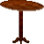
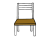

Bienvenido a "Bob el constructor". Este juega hará revivir su gusto por la creación de objetos. 
El objetivo principal del juego es construir alguno de los siguientes objetos sin morir en el intento.

Bob, al igual que vos, puede estar cansado(inicialmente se encuentra totalmente enérgico). 
Para que Bob pueda recuperar energía y seguir trabajando en recolectar o construir un objeto, tendrá que ir a descansar a cualquier 
de los lugares de descanso disponibles.A la hora de recolectar los materiales debe ser muy cuidadoso y ver donde pisa al caminar 
ya que encontrará bastantes obstáculos, nuestro constructor no sabe nadar!. Por lo tanto de caer al agua, morirá ahogado. 
También es alérgico a los hongos, por lo que no deberá pasar sobre ellos, o estos afectarán su salud y podrán causar su muerte.
Por otro lado, se encontrará con una lluvia de ladrillos, el cual por la ayuda de su casco lo protege de morir de inmediato.

Objetivo del nivel 1.

La tecla "A" crea la mesa cuando dispongas de:
♦5 piezas de madera
♦2 piezas de metal 
♦20 puntos de energía.

Objetivo del nivel 2

La tecla "S" crea la silla cuando dispongas de:
♦4 piezas de madera
♦3 piezas de metal
♦50 puntos de energia

La tecla "D" crea el martillo cuando dispongas de:
♦3 piezas de madera
♦3 piezas de metal
♦3 piezas de piedra
♦80 puntos de energia
